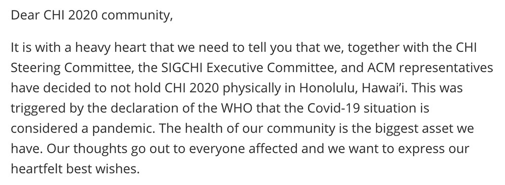

어제, CHI 학회가 취소되었다는 통보를 들었다. 정확하게 말하면 physical한 컨퍼런스가 취소되었다는 뜻으로, remote conference, 일정 변경 등 다른 방법으로 학회 자체를 진행할 가능성은 여전히 있다. 어쨌든 내 첫 학회, 첫 CHI, 첫 풀페이퍼, 첫 퍼블리케이션, 그리고 첫 수상이라는 가치 때문에 개인적으로 많이 기대했기 때문에, 많이 아쉬웠다.

어쩔 수 없다는 걸 잘 알고 있다. Decision notification이 올 땐 누구도 학회가 취소되리라곤, 학교 수업 개강이 연기될 줄은 몰랐지 않았나. 게다가 많은 사람들이 COVID-19로 정신 없는 상황에서, 학회를 강행하는게 더 말이 안된다는 것도 잘 이해하고 있다. 다만 유일하게 내 운명에 대해선 고민을 하게 된다.

인생사란게 항상 굴곡졌다. 몸이 안좋아서 공부할 때 불편했는데, 그러면서 꾸역꾸역 하면서 운좋게 대학을 오게 되었다. 근데 대학에 와서도 몸이 안좋고 공부에 흥미가 없어서 손을 놓다시피 하다가, 어떤 분야에 흥미가 생겨서 성과를 내놓게 되었다. 근데 또 그 성과는 결국 의미가 줄어들고, 또 어떤 일이 일어날 지는 미리 알 방법이 없다. 나열한 모든 일들이 일어나기 1년 전에는 상상조차 못할 일이었다. 100개의 예상을 하면 개중 1개 정도는 그래도 이뤄지긴 했는데, 반대로 99개는 언제나 다르게 흘러갔다.

어떻게 보면 인생에서 아주 짧은 기간의 '학회'라는 이벤트에서도 나는 강박적으로 계획하는 것 같다. 리서치 핏이 맞는 어느 교수랑 만나고, 발표를 해서 이러이러한 질문에 답변하고, 기타등등.. 그런데 이런 작은 계획들 마저 싹다 생각과는 다르게 흘러가지 않나? 그래서 결국 어떤 일이 일어날 때 중요한건 내 태도 자체다. 사실 여전히 잘 안되긴 하지만, 계획은 하되 기대나 실망은 하지 않는게 정말로 맘이 편하다.

대신에, 이번 여름방학때 개인적으로 하와이 여행은 꼭 갈거다. 거기서 뭐 혼자 발표 내용 읊고 셀프 수상을 하든지 해야지.